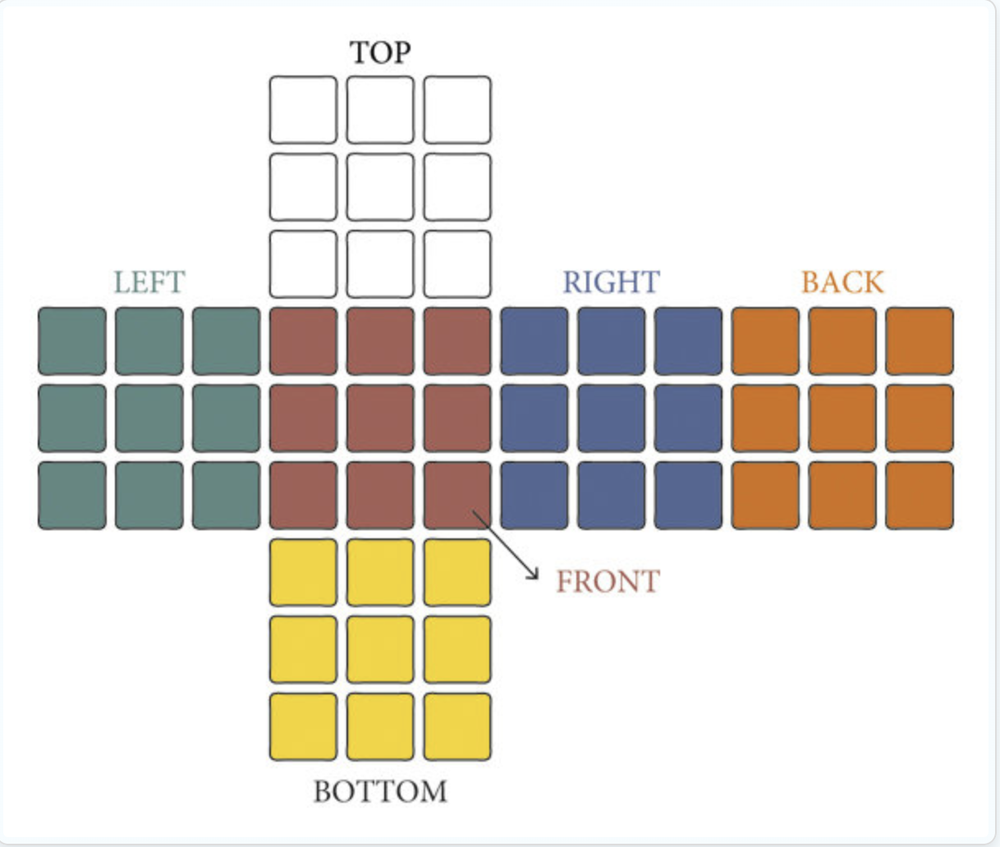

---

# Rubik's Cube Solver

This project implements a complete, extensible Rubik’s Cube solving engine in C++. It brings together classical search algorithms and optimized cube representations to explore state-space efficiently and solve the cube in minimal moves.

---

## Cube Representations

Three internal representations of the Rubik’s Cube are provided:

1. **3D Array Representation**  
   Mimics the physical structure of the cube using a 6×3×3 array. Easy to debug and understand, though less performant.

2. **1D Array Representation**  
   Stores cube state linearly. Allows faster iteration and simpler indexing for pattern generation and search.

3. **Bitboard Representation**  
   Encodes the cube into a set of 64-bit integers using bitwise operations. Offers high-speed state transitions and hashing efficiency. Ideal for performance-critical solvers.

All representations inherit from a common base class defining abstract cube operations.

---

## Solving Algorithms

The following AI-based search algorithms are implemented for solving the cube:

1. **Breadth-First Search (BFS)**  
   Explores all states level-by-level.  
   Guarantees shortest path but consumes exponential memory.  
   Used for small state validation and comparative benchmarking.

2. **Depth-First Search (DFS)**  
   Explores deeply before backtracking.  
   Low memory usage, but not optimal or complete.  
   Serves as a baseline for simple traversal.

3. **Iterative Deepening DFS (IDDFS)**  
   Combines DFS memory efficiency with BFS completeness.  
   Repeatedly applies DFS with increasing depth limits.  
   Ensures all solutions are found eventually.

4. **Iterative Deepening A\* (IDA\*)**  
   Guided version of IDDFS using a heuristic function.  
   Dramatically improves performance by exploring promising paths first.  
   Uses admissible Pattern Databases as heuristics.


Each solver is implemented as a template class and supports any cube representation.

---

## Heuristics and Pattern Databases

To make IDA\* practical for solving a large state space like the Rubik's Cube, the system uses **Pattern Databases (PDBs)** as admissible heuristics.

- The corner PDB is implemented and used as the heuristic in IDA\*.
- All possible corner configurations are indexed using a permutation-based system.
- Each index maps to the fewest number of moves required to solve the corners from that state.
- These values are stored in a file and loaded during solver execution, ensuring fast lookups without recomputation.

The **Permutation Indexer** class is responsible for encoding and decoding permutations into unique integer values, essential for building and accessing the PDB.

---

## Planar Representation of Rubik’s Cube

To facilitate internal visualization and implementation logic, the cube is represented in a **2D planar format** during development.

<p align="center">
  
</p>

Each square represents a cubie, and the structure maps directly to face indices and rotation logic in the codebase. This view helps visualize transformations clearly, especially in the 3D and 1D implementations.

---

## Key Learnings

This project involved in-depth exploration of both software engineering practices and AI algorithms. Key takeaways include:

- How to model a real-world object like a Rubik’s Cube into a programmable structure  
- Breaking a complex problem (optimal solving) into layered components: representation, state manipulation, solver interface, and search strategies  
- Applying Object-Oriented Programming (OOP) concepts:  
  - Abstract base classes and polymorphism  
  - Inheritance for extending representations and solvers  
  - Operator overloading for equality and hashing  
- Designing and using custom `unordered_map` hash functions for cube states  
- Bit manipulation techniques for compact state representation  
- Heuristic search with admissible Pattern Databases  
- Implementation of classical AI path-finding algorithms  
- File I/O and serialization for saving/loading Pattern Databases  
- Use of generic programming and templates for solver reusability  
- Black-box abstraction via permutation indexing  

---

## Build Instructions

This is a pure C++ project and should compile with any standard-compliant C++17 compiler.

```bash
g++ -std=c++17 -O2 main.cpp -o cube_solver
./cube_solver
```

Make sure to build the Pattern Database (or load an existing one) before running the IDA\* solver.

---

## References

- **Korf, R. E. (1997).**  
  *Finding optimal solutions to Rubik’s Cube using pattern databases.*  
  [Read the paper here](https://cse.sc.edu/~mgv/csce580sp15/korfRubik.pdf)

---

## License

This project is licensed under the MIT License.

---
